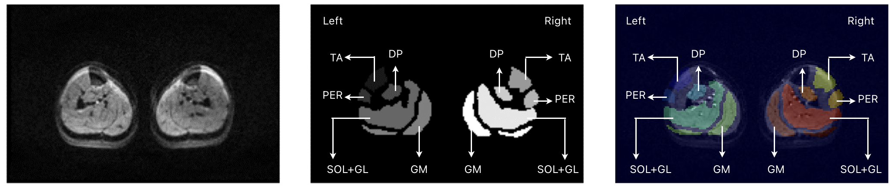
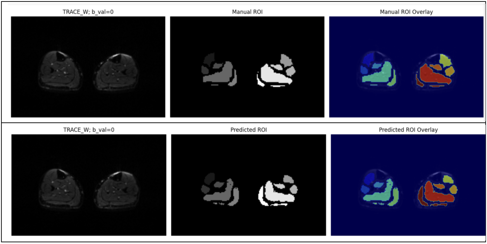

# Lower Limb Calf Muscle Segmentation from Diffusion-Weighted Magnetic Resonance Images Using Deep Learning

Peripheral artery disease (PAD) affects blood flow
to the limbs, and diffusion-weighted magnetic resonance imaging
(DW-MRI) can quantify microvascular perfusion and diffusion
in calf muscles, aiding diagnosis. However, manual segmentation
is time consuming and subjective. We propose a conditional
generative adversarial network (cGAN) with an enhanced U-Net
architecture for automated segmentation of calf muscles from
DW-MRI. Our method leverages data augmentation to address
small dataset sizes, splitting images into left and right halves and
applying flipping and progressive rotation. Evaluated on datasets
of healthy and PAD patients, our approach achieves average Dice
Similarity Coefficient (Dice) scores of 54.86% to 79.85% across
muscle groups, significantly outperforming baseline models
(original U-Net architecture with cGAN and no data
augmentation). This work demonstrates the potential of deep
learning for automating segmentation in PAD diagnosis, offering
a scalable solution for clinical applications.

*Figure: Diffusion-weighted MR image (left), manually delineated ROIs (centre), manually delineated ROIs overlaid on the DWI (right) of one subject*

The enhanced U-Net adds forward blocks with skip connections after each upsampling and downsampling layer, preserving spatial information by not downsampling below 8x8 (unlike the original U-Net’s 1x1). This reduces parameters (159.38 MB vs. 207.62 MB) while improving generalization. Forward block is an additional convolutional block structurally identical to the preceding convolution layer. 
### Table below shows a comparison of the original U-Net and the proposed Enhanced U-Net.

| Original U-Net                                                                                                                                                                                                                                                                                                                          |                                                                                                                                                                                                                                                                                                                                                                                                                                                                                     |                                                                                                                                                                   | Enhanced U-Net                                                                                                                                                                                                                                                                                                                                                                    |                                                                                                                                                                                                                                                                                                                                                                                                                                                                                                                                                                      |                                                                                                                                                                                 |
|-----------------------------------------------------------------------------------------------------------------------------------------------------------------------------------------------------------------------------------------------------------------------------------------------------------------------------------------|-------------------------------------------------------------------------------------------------------------------------------------------------------------------------------------------------------------------------------------------------------------------------------------------------------------------------------------------------------------------------------------------------------------------------------------------------------------------------------------|-------------------------------------------------------------------------------------------------------------------------------------------------------------------|-----------------------------------------------------------------------------------------------------------------------------------------------------------------------------------------------------------------------------------------------------------------------------------------------------------------------------------------------------------------------------------|----------------------------------------------------------------------------------------------------------------------------------------------------------------------------------------------------------------------------------------------------------------------------------------------------------------------------------------------------------------------------------------------------------------------------------------------------------------------------------------------------------------------------------------------------------------------|---------------------------------------------------------------------------------------------------------------------------------------------------------------------------------|
| Layer                                                                                                                                                                                                                                                                                                                                   | Output Shape                                                                                                                                                                                                                                                                                                                                                                                                                                                                        | Params                                                                                                                                                            | Layer                                                                                                                                                                                                                                                                                                                                                                             | Output Shape                                                                                                                                                                                                                                                                                                                                                                                                                                                                                                                                                         | Params                                                                                                                                                                          |
| Input Layer Sequential_2 Sequential_3 Sequential_4 Sequential_5 Sequential_6 Sequential_7 Sequential_8 Sequential_9 Sequential_10 Concatenate Sequential_11 Concatenate_1 Sequential_12 Concatenate_2 Sequential_13 Concatenate_3 Sequential_14 Concatenate_4 Sequential_15 Concatenate_5 Sequential_16 Concatenate_6 Conv2DTranspose_8 | (None, 256, 256, 3) (None, 128, 128, 64) (None, 64, 64, 128) (None, 32, 32, 256) (None, 16, 16, 512) (None, 8, 8, 512) (None, 4, 4, 512) (None, 2, 2, 512) (None, 1, 1, 512) (None, 2, 2, 512) (None, 2, 2, 1024) (None, 4, 4, 512) (None, 4, 4, 1024) (None, 8, 8, 512) (None, 8, 8, 1024) (None, 16, 16, 512) (None, 16, 16, 1024) (None, 32, 32, 256) (None, 32, 32, 512) (None, 64, 64, 128) (None, 64, 64, 256) (None, 128, 128, 64) (None, 128, 128, 128) (None, 256, 256, 3) | 0 3,072 131,584 525,312 2,099,200 4,196,352 4,196,352 4,196,352 4,196,352 4,196,352 0 8,390,656 0 8,390,656 0 8,390,656 0 4,195,328 0 1,049,088 0 262,400 0 6,147 | Input Layer Sequential_2 Sequential_3 Sequential_4 Sequential_5 Sequential_6 Sequential_7 Sequential_8 Sequential_9 Sequential_19 Sequential_11 Concatenate Sequential_12 Concatenate_1 Sequential_13 Concatenate_2 Sequential_14 Concatenate_3 Sequential_15 Concatenate_4 Sequential_16 Concatenate_5 Sequential_17 Concatenate_6 Sequential_18 Concatenate_7 Conv2DTranspose_8 | (None, 256, 256, 1) (None, 128, 128, 64) (None, 128, 128, 64) (None, 64, 64, 128) (None, 64, 64, 128) (None, 32, 32, 256) (None, 32, 32, 256) (None, 16, 16, 512) (None, 16, 16, 512) (None, 8, 8, 1024) (None, 16, 16, 512) (None, 16, 16, 1024) (None, 16, 16, 512) (None, 16, 16, 1024) (None, 32, 32, 256) (None, 32, 32, 512) (None, 32, 32, 256) (None, 32, 32, 512) (None, 64, 64, 128) (None, 64, 64, 256) (None, 64, 64, 128) (None, 64, 64, 256) (None, 128, 128, 64) (None, 128, 128, 128) (None, 128, 128, 64) (None, 128, 128, 128) (None, 256, 256, 6) | 0 1,280 65,792 131,584 262,656 525,312 1,049,600 2,099,200 4,196,352 8,392,704 8,390,656 0 8,390,656 0 4,195,328 0 2,098,176 0 1,049,088 0 524,800 0 262,400 0 131,328 0 12,294 |
| Total params: 54,425,859 (207.62 MB) Trainable params: 54,414,979 (207.58 MB) Non-trainable params: 10,880 (42.50 KB)                                                                                                                                                                                                                   |                                                                                                                                                                                                                                                                                                                                                                                                                                                                                     |                                                                                                                                                                   | Total params: 41,779,206 (159.38 MB) Trainable params: 41,769,478 (159.34 MB) Non-trainable params: 9,728 (38.00 KB)                                                                                                                                                                                                                                                              |                                                                                                                                                                                                                                                                                                                                                                                                                                                                                                                                                                      |                                                                                                                                                                                 |

### Training configuration of various models
| MODELS                 | Discriminator  | Generator      | Training Data    | Data Augmentation | Fine tuning |
|------------------------|----------------|----------------|------------------|-------------------|-------------|
| SegModel_01 (Baseline) | Yes            | Original U-Net | Healthy Subjects | No                | No          |
| SegModel_02 (Baseline) | Yes            | Original U-Net | All Subjects     | No                | No          |
| SegModel_03            | Yes            | Enhanced U-Net | Healthy Subjects | No                | No          |
| SegModel_04            | Yes            | Enhanced U-Net | All Subjects     | No                | No          |
| SegModel_05            | Yes            | Enhanced U-Net | Healthy Subjects | Yes               | No          |
| SegModel_06            | No             | Enhanced U-Net | Healthy Subjects | Yes               | Yes         |
| SegModel_07            | No             | Enhanced U-Net | All Subjects     | Yes               | Yes         |

### Average Dice score for each muscle group by various segmentation models

| MODELS                       | TA left | PER left | DP left | SOL GL Left | GM left | TA right | PER right | DP right | SOL GL right | GM right |
|------------------------------|---------|----------|---------|-------------|---------|----------|-----------|----------|--------------|----------|
| SegModel_01 (baseline model) | 29.32%  | 4.09%    | 1.01%   | 4.26%       | 2.65%   | 29.23%   | 4.22%     | 1.61%    | 5.11%        | 1.88%    |
| SegModel_02 (baseline model) | 2.27%   | 1.21%    | 2.86%   | 0.00%       | 0.00%   | 10.88%   | 2.07%     | 1.74%    | 0.00%        | 0.00%    |
| SegModel_03                  | 1.98%   | 0.14%    | 0.21%   | 1.24%       | 0.19%   | 0.89%    | 0.08%     | 1.95%    | 1.95%        | 0.22%    |
| SegModel_04                  | 9.03%   | 2.40%    | 4.20%   | 0.00%       | 7.21%   | 7.68%    | 3.21%     | 3.83%    | 0.16%        | 7.65%    |
| SegModel_05                  | 62.42%  | 34.81%   | 36.12%  | 65.93%      | 47.47%  | 67.86%   | 44.98%    | 42.99%   | 70.95%       | 48.42%   |
| SegModel_06                  | 38.54%  | 27.48%   | 51.71%  | 67.37%      | 45.84%  | 69.57%   | 56.52%    | 51.65%   | 71.61%       | 50.18%   |
| SegModel_07                  | 66.89%  | 54.86%   | 66.24%  | 77.82%      | 57.95%  | 79.85%   | 74.27%    | 62.83%   | 78.04%       | 60.54%   |

*Figure: Visual comparison of the manually drawn region of interest and auto segmentation (predicted region of interest) using model SegModel_07*
